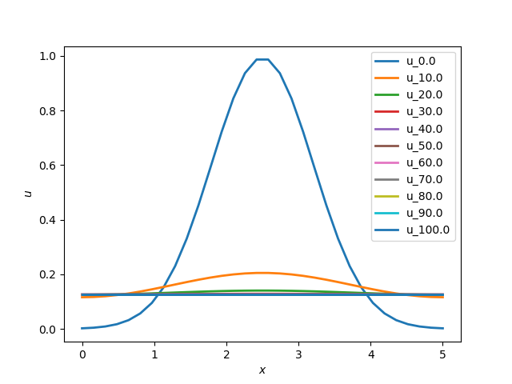

# 2d Heat and Swift-Hohenberg(2dSH23) Equations using Fourier Spectral Method
## Author: Pratik Aghor

* Time marching 1d viscous Burger's equation using Chebyshev spectral method
* In order to run the codes, please do ```bash build.sh```
* In order to run the test for ```test_fft.py```, please do ```bash build_tests.sh```
* In order to run the test for ```test_2d_heat.py```, please do ```bash build_heat_test.sh```

* Nxc = Nx - 1; Nyc = Ny -1; are computational grid-points. We do not include the last point
because fft2 assumes periodic bc's in both directions. We pad the matrix later while saving
the solution. All computations are performed on (Nyc x Nxc) grid.

* L = linear operator in Fourier space
* v is the 2d fft of u

* In fact, L should have been a 3d matrix with dimensions [Nyc, Nxc, Nxc],
in the sense, that for each y, we should invert have an Nxc x Nxc matrix.

* However, in this particular case, the (Nxc x Nxc) matrix we would get is diagonal,
as the linear operator only consists of (Dx[j]*Dx[j] + Dy[i]*Dy[i]).

* The A matrix from AM2AB2 algorithm (see documentation), is in fact a matrix of dimensions
[Nyc, Nxc, Nxc]. For each i value (for a fixed y), we have a diagonal matrix with constants.

* In order to invert this matrix, we need only do inversion of the diagonal entries.

* Here I write L[i, j] as a 2d matrix meant as an alias for the original 3d matrix.

* Each i^(th) row of L[i, j] corresponds to the diagonal of the (Nxc x Nxc) matrix.

* We must NOT treat L[i, j] as a regular 2d matrix, but think of each row of L[i, j]
to be a diagonal matrix. The A-matrix = (I - 0.5*dt*L) is then merely -
A[i, j] = (1.0 - 0.5*dt*L[i, j]).

* The A-matrix again, is an alias for the original 3d matrix whose rows must be thought
of as diagonals of Nx x Nx matrices at each fiexed i.

* Hence, in order to find Ainv, we need only invert each entry of A element-wise.

* Similarly, we can create the matrix B[i, j] = (1.0 + 0.5*dt*L[i, j]).

* Again, B[i, j] is a 2d stand-in for the original 3d matrix of size [Nyc, Nxc, Nxc].

* By construction, the ```matmul(B, u)``` for example would become element-wise multiplication
```multiply(B, u)```.

* We must take care of this during time marching.

### Files and usage 

* ```params.py``` defines the parameters such as the grid and time step, etc.

* ```test_fft.py``` has a test to decide the ordering of Fourier wave-vectors in python. For details, please read the blog. 
* ```burger_fourier_PratikAghor.py``` is the main file that does the time marching and saves the data in the data folder.
* ```post_process.py``` does post processing - reading and plotting the data.


### Wrote a test for 2d heat equation:
* In order to run the test for ```test_2d_heat.py```, please do ```bash build_heat_test.sh```
* It seems to work just fine for a given 1d IC of ```sin(xc)```

