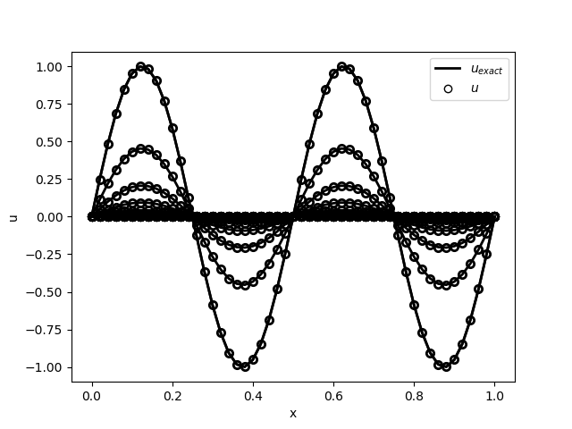

# 1D Heat Equation Crank Nicholson
## Author: Pratik Aghor

* Time marching 1d Heat equation using CN
* In order to run the codes, please do ```bash build.sh```

### Files and usage 

* ```params.py``` defines the parameters such as the grid and time step, etc.
* ```heat_CN_functions.py``` defines the important matrices as well as boundary conditions. It also contains a code to solve Ax = b using QR factorization.
* ```heat_CN_main.py``` is the main file that does the time marching and saves the data in the data folder.
* ```post_process.py``` does post processing - reading and plotting the data, comparing the numerical solution with the exact one, and getting the damping rate out.
* Exact solution vs numerical solution


* Exact $\sigma$ vs numerical damping rate


