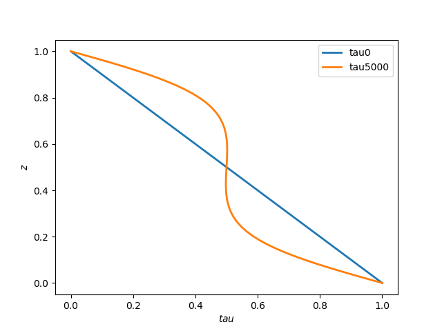

# Code to integrate Euler-Lagrange equations for porous medium convection with Dirichlet boundaries using Chebyeshev spectral method.
## Author: Pratik Aghor

* Time marching 1d viscous Euler-Lagrange equations for porous medium convection with Dirichlet boundaries using Chebyshev spectral method
* In order to run the codes, please do ```bash build.sh```


### Files and usage 

* ```params.py``` defines the parameters such as the grid and time step, etc.
* ```cheb.py``` contains the code to obtain the d()/dx operator (D-matrix) on the computational grid (Chebyshev-Gauss-Lobatto) and the Chebyshev-Gauss-Lobatto grid.
* ```qrsolve.py``` contains the code to solve Ax = b using QR factorization.
* ```upperbound.py``` is the main file that does the time marching and saves the data in the data folder.
* ```post_process.py``` does post processing - reading and plotting the data.


