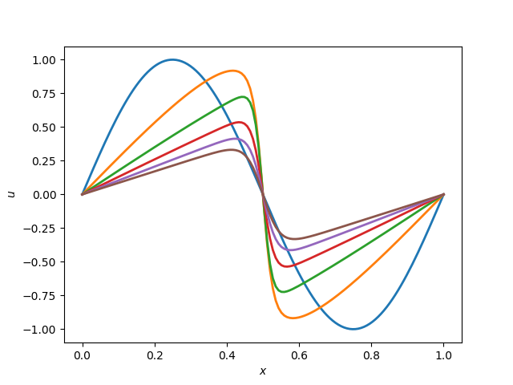

# 1d Viscous Burger's Equation using Fourier Spectral Method
## Author: Pratik Aghor

* Time marching 1d viscous Burger's equation using Chebyshev spectral method
* In order to run the codes, please do ```bash build.sh```
* In order to run the test for ```cheb.py```, please do ```bash build_test.sh```

### Files and usage 

* ```params.py``` defines the parameters such as the grid and time step, etc.

* ```test_fft.py``` has a test to validate ```cheb.py```
* ```burger_fourier_PratikAghor.py``` is the main file that does the time marching and saves the data in the data folder.
* ```post_process.py``` does post processing - reading and plotting the data.


